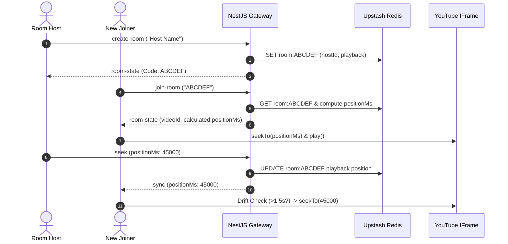

# vynyl Architecture & Engineering Decisions ✦

This document explains the core technical decisions, real-time audio synchronization algorithms, and edge-case handling strategy behind **Vynyl**.

---

## ✦ 1. Real-Time Synchronization & Clock Drift

Syncing audio playback across multiple web browsers over heterogeneous networks is a complex challenge. Vynyl solves this using a **Server Epoch Timestamping** pattern combined with **Soft Client Drift Alignment**.

### Server Epoch Timestamping (No Ticking Clock)
Rather than running an active interval timer on the server for every room (which degrades CPU performance under thousands of rooms), the server stores two atomic values in Redis:
- `startedAt`: Epoch timestamp (ms) when playback was initiated or resumed.
- `positionMs`: Track elapsed time (ms) at the moment playback started.

When a client queries playback status, `SyncService.calculateCurrentPosition()` computes the exact position on demand:
$$\text{Current Position} = \text{positionMs} + (\text{Date.now()} - \text{startedAt})$$

If playback is paused, `startedAt` is `null`, and `positionMs` represents the static paused timestamp.

### Soft Client Alignment (Anti-Stutter Algorithm)
Network jitter and socket latency cause minor arrival variance (50ms–300ms). Seeking the YouTube iframe player too aggressively creates audible stutter and buffering loops.

In `youtube-player.tsx`, Vynyl enforces a **1.5-Second Soft Alignment Threshold**:
- **Drift $< 1.5$s:** The client ignores minor delta variations and lets natural audio playback continue without seeking.
- **Drift $> 1.5$s:** The client executes `player.seekTo(expectedPosition, true)` to snap back into exact room alignment instantly.

---

## ✦ 2. How Vynyl Handles Distributed Scenarios & Edge Cases

### 1. Late Joiners (Joining Halfway Through a Song)
* **Problem:** A user joins a room 2 minutes into a 4-minute track.
* **Solution:** When `POST /rooms/:code/join` or socket `join-room` executes, NestJS computes the exact elapsed position at that microsecond. The initial `room-state` payload delivers the video ID, `playing: boolean`, and calculated `positionMs`. On component mount, the client iframe seeks directly to `positionMs` before unmuting.

### 2. Single Host Authority & Race Condition Prevention
* **Problem:** Multiple users clicking `play`, `pause`, or `seek` simultaneously can cause playback loops or conflicting commands.
* **Solution:** In `sync.gateway.ts`, every mutating command passes through `assertHost(client, code)`. The gateway verifies the socket's `memberId` matches `room.hostId` in Redis. Non-host command attempts are rejected instantly (`"Only the host can control playback"`). Additionally, `SocketRateLimiterService` caps host control actions to 10 per 5 seconds per socket.

### 3. Host Disconnects & Grace Period Timeout
* **Problem:** If the host refreshes their tab or experiences spotty Wi-Fi, the room should not collapse or lose leadership.
* **Solution:** When a host socket disconnects, `SyncGateway.handleDisconnect` initiates a **Host Disconnect Grace Period**. If the host reconnects within the window (matching `memberId`), the timer is cleared seamlessly. If the grace period expires without reconnection, `roomService.removeMember` automatically transfers host leadership (`isHost: true`) to the next oldest member and broadcasts `host-changed`.

### 4. YouTube Player Errors & Un-embeddable Tracks
* **Problem:** Certain YouTube videos are restricted from third-party embedding by copyright holders or uploaders.
* **Solution:**
  1. **Pre-Filter:** Official YouTube API calls filter out items where `status.embeddable === false`.
  2. **Runtime Catch:** If an un-embeddable track slips through, `youtube-player.tsx` catches YouTube error codes `101` / `150`. If the client is host, it automatically triggers `next-track` to skip to the next queued item without stalling the room.

### 5. Rate Limiting & Bot Defense
* **Problem:** Public launches attract bot scrapers and room creation spam.
* **Solution:** Redis-backed sliding-window rate limiters (`RateLimitGuard` & `SocketRateLimiterService`):
  - `POST /rooms`: Max 5 / min per IP.
  - `POST /rooms/:code/join`: Max 10 / min per IP.
  - `GET /search`: Max 20 / min per IP.
  - Socket `create-room`: Max 3 / min per connection.
  - Socket `queue-add`: Max 10 / min per connection.

### 6. Horizontal Server Scaling
* **Problem:** In-memory web server state prevents scaling backend containers across multiple server nodes.
* **Solution:** NestJS instances are completely stateless. All room states (`room:<code>`), member registries, and queues (`queue:<code>`) reside in Upstash Redis. Using Socket.IO’s Redis Pub/Sub adapter, room broadcasts (`server.to(code).emit(...)`) fan out across multiple backend server nodes seamlessly.

---

## ✦ 3. System Architecture Diagram

